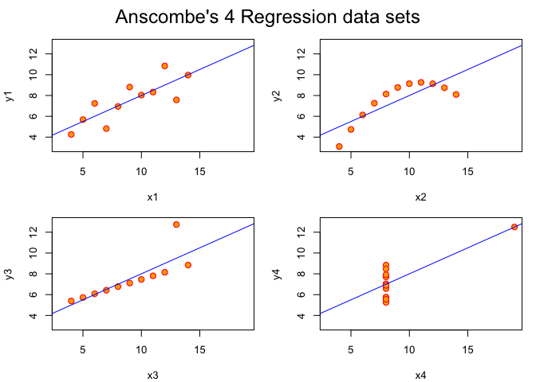

Anscombe quartet
================

(All code from R examples for datasets::anscombe)

### The data

       x1 x2 x3 x4    y1   y2    y3    y4
    1  10 10 10  8  8.04 9.14  7.46  6.58
    2   8  8  8  8  6.95 8.14  6.77  5.76
    3  13 13 13  8  7.58 8.74 12.74  7.71
    4   9  9  9  8  8.81 8.77  7.11  8.84
    5  11 11 11  8  8.33 9.26  7.81  8.47
    6  14 14 14  8  9.96 8.10  8.84  7.04
    7   6  6  6  8  7.24 6.13  6.08  5.25
    8   4  4  4 19  4.26 3.10  5.39 12.50
    9  12 12 12  8 10.84 9.13  8.15  5.56
    10  7  7  7  8  4.82 7.26  6.42  7.91
    11  5  5  5  8  5.68 4.74  5.73  6.89

### ANOVA

    Analysis of Variance Table

    Response: y1
              Df Sum Sq Mean Sq F value  Pr(>F)   
    x1         1 27.510 27.5100   17.99 0.00217 **
    Residuals  9 13.763  1.5292                   
    ---
    Signif. codes:  0 '***' 0.001 '**' 0.01 '*' 0.05 '.' 0.1 ' ' 1
    Analysis of Variance Table

    Response: y2
              Df Sum Sq Mean Sq F value   Pr(>F)   
    x2         1 27.500 27.5000  17.966 0.002179 **
    Residuals  9 13.776  1.5307                    
    ---
    Signif. codes:  0 '***' 0.001 '**' 0.01 '*' 0.05 '.' 0.1 ' ' 1
    Analysis of Variance Table

    Response: y3
              Df Sum Sq Mean Sq F value   Pr(>F)   
    x3         1 27.470 27.4700  17.972 0.002176 **
    Residuals  9 13.756  1.5285                    
    ---
    Signif. codes:  0 '***' 0.001 '**' 0.01 '*' 0.05 '.' 0.1 ' ' 1
    Analysis of Variance Table

    Response: y4
              Df Sum Sq Mean Sq F value   Pr(>F)   
    x4         1 27.490 27.4900  18.003 0.002165 **
    Residuals  9 13.742  1.5269                    
    ---
    Signif. codes:  0 '***' 0.001 '**' 0.01 '*' 0.05 '.' 0.1 ' ' 1

### Models

                      lm1      lm2       lm3       lm4
    (Intercept) 3.0000909 3.000909 3.0024545 3.0017273
    x1          0.5000909 0.500000 0.4997273 0.4999091

    $lm1
                 Estimate Std. Error  t value    Pr(>|t|)
    (Intercept) 3.0000909  1.1247468 2.667348 0.025734051
    x1          0.5000909  0.1179055 4.241455 0.002169629

    $lm2
                Estimate Std. Error  t value    Pr(>|t|)
    (Intercept) 3.000909  1.1253024 2.666758 0.025758941
    x2          0.500000  0.1179637 4.238590 0.002178816

    $lm3
                 Estimate Std. Error  t value    Pr(>|t|)
    (Intercept) 3.0024545  1.1244812 2.670080 0.025619109
    x3          0.4997273  0.1178777 4.239372 0.002176305

    $lm4
                 Estimate Std. Error  t value    Pr(>|t|)
    (Intercept) 3.0017273  1.1239211 2.670763 0.025590425
    x4          0.4999091  0.1178189 4.243028 0.002164602

### Plots

