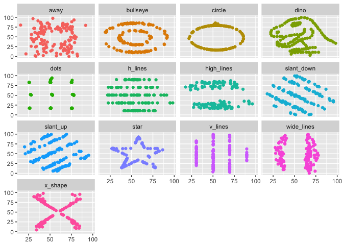

# DinosauRus


From (https://www.autodeskresearch.com/publications/samestats)

## The dataset...

```r
datasaurus_dozen
```

```
## # A tibble: 1,846 x 3
##    dataset       x       y
##      <chr>   <dbl>   <dbl>
##  1    dino 55.3846 97.1795
##  2    dino 51.5385 96.0256
##  3    dino 46.1538 94.4872
##  4    dino 42.8205 91.4103
##  5    dino 40.7692 88.3333
##  6    dino 38.7179 84.8718
##  7    dino 35.6410 79.8718
##  8    dino 33.0769 77.5641
##  9    dino 28.9744 74.4872
## 10    dino 26.1538 71.4103
## # ... with 1,836 more rows
```

## Summary statistics


```r
summary_stats <- datasaurus_dozen %>% 
  group_by(dataset) %>% 
  mutate_at(vars(x, y), funs(mean, sd)) %>% 
  mutate(cor = cor(x, y)) %>% 
  select(-x, -y) %>% 
  distinct() %>% 
  mutate_if(is_double, round, 2)

kable(summary_stats)
```


dataset       x_mean   y_mean    x_sd    y_sd     cor
-----------  -------  -------  ------  ------  ------
dino           54.26    47.83   16.77   26.94   -0.06
away           54.27    47.83   16.77   26.94   -0.06
h_lines        54.26    47.83   16.77   26.94   -0.06
v_lines        54.27    47.84   16.77   26.94   -0.07
x_shape        54.26    47.84   16.77   26.93   -0.07
star           54.27    47.84   16.77   26.93   -0.06
high_lines     54.27    47.84   16.77   26.94   -0.07
dots           54.26    47.84   16.77   26.93   -0.06
circle         54.27    47.84   16.76   26.93   -0.07
bullseye       54.27    47.83   16.77   26.94   -0.07
slant_up       54.27    47.83   16.77   26.94   -0.07
slant_down     54.27    47.84   16.77   26.94   -0.07
wide_lines     54.27    47.83   16.77   26.94   -0.07

## Scatter plots


```r
ggplot(datasaurus_dozen, aes(x, y, colour = dataset)) +
  geom_point() +
  facet_wrap(~ dataset) +
  theme(legend.position = "none") +
  labs(x = NULL, y = NULL)
```

<!-- -->
